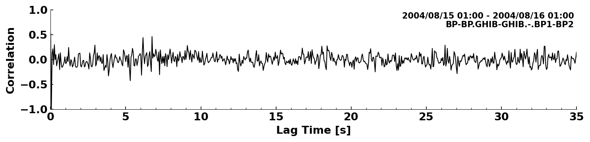

.. mermaid::

    %%{init: { 'logLevel': 'debug', 'theme': 'base' } }%%
    graph LR
        waveform[Get Data] --> correlate(Correlation)
        correlate:::active -->|save| corrdb[(CorrDB/hdf5)]
        corrdb --> monitor
        monitor[Measure dv] -->|save| dv{{DV}}
        click waveform "../trace_data.html" "trace_data"
        click correlate "../correlate.html" "correlate"
        click monitor "../monitor.html" "monitor"
        click corrdb "../corrdb.html" "CorrDB"
        click dv "../monitor/dv.html" "DV"
        classDef active fill:#f666, stroke-width:4px, stroke:#f06;

CorrTrace, CorrStream, and CorrBulk classes
-------------------------------------------

Once the correlations are actually computed, they are assigned as :class:`~miic3.correlate.stream.CorrTrace` and :class:`~miic3.correlate.stream.CorrStream` objects.
Both inherit most of their methods and attributes from their `obspy <https://docs.obspy.org/>`_ parents. However, there are some extra attributes and functionalities.

CorrTrace
+++++++++

Most notably a new Header object (:class:`~miic3.correlate.stats.CorrStats`) with different attributes is associated to this type of trace. The header takes care of
saving vital information like lag times (``start_lag`` and ``end_lag``), the start- and the endtime of the waveforms that were used to compute the correlation (``corr_start`` and ``corr_end``, respectively),
and information about the coordinates of the stations.

:class:`~miic3.correlate.stream.CorrTrace` does also come with its own plotting method :meth:`~miic3.correlate.stream.CorrTrace.plot` (check it for details). It can produce plots akin to this one:

CorrStream
++++++++++

Essentially, this class is just a fancy list of :class:`~miic3.correlate.stream.CorrTrace` objects. However, it has methods to stack (:meth:`~miic3.correlate.stream.CorrStream.stack`),
select (:meth:`~miic3.correlate.stream.CorrStream.select_corr_time`), or slide (:meth:`~miic3.correlate.stream.CorrStream.slide`) time windows. It also enables us to create section stacks, sorted
by interstation distance or time:

.. image:: ../../figures/cst.svg

CorrBulk
++++++++

:class:`~miic3.correlate.stream.CorrStream` does also have a method to create a :class:`~miic3.correlate.stream.CorrBulk` object (:meth:`~miic3.correlate.stream.CorrStream.create_corr_bulk`).
Instead of relying on a list of traces, this object is based on numpy arrays, which makes postprocessing computationally cheaper. Check out :class:`~miic3.correlate.stream.CorrBulk` for available
post processing functions.