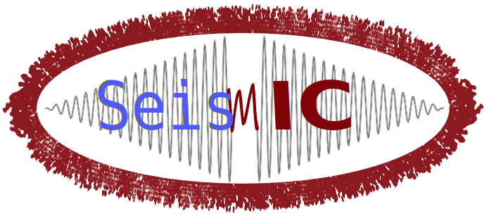

Introduction: Noise Interferometry with (Partial) Green's Function Retrieval
============================================================================
Most of today's ambient seismic noise tomography studies are based on the assumption that the Green's function between two stations can be approximated by the Cross-correlation of the noise between the stations.
In theory, this assumption is only reasonable **if the noise sources are homogeneously distributed in space and time**. In practice however, this is almost never the case and various (pre)processing techniques are employed to
account for directional and/or time-varying sources (e.g., Fichtner and Tsai, 2019).

In **SeisMIC**, methods for preprocessing and correlating ambient seismic noise records are located in the ``seismic.correlate`` module. Aside from interstation cross-correlations, **SeisMIC** does also allow to
compute intercomponent and autocorrelations, which are assumed to be an approximation of the Green's functions in station vicinity or,
at least, stable estimations of the impulse response of a selected part of the station vicinity. This can be justified with the presence of coda waves that,
as a consequence of multiple scattering, are recorded several times by the seismometer.

For a more thorough read, we recommend the following literature:

`Hadziioannou et al., 2009 <https://doi.org/10.1121/1.3125345>`_
`Hadziioannou et al., 2011 <https://doi.org/10.1029/2011JB008200>`_
`Weaver et al., 2011 <https://doi.org/10.1111/j.1365-246X.2011.05015.x>`_
`Sens-Schönfelder & Wegler, 2011 <https://doi.org/10.1016/j.crte.2011.02.005>`_
`Wang et al., 2020 <http://www.eppcgs.org/en/article/doi/10.26464/epp2020048>`_

`Book: Seismic Ambient Noise <https://doi.org/10.1017/9781108264808>`_
