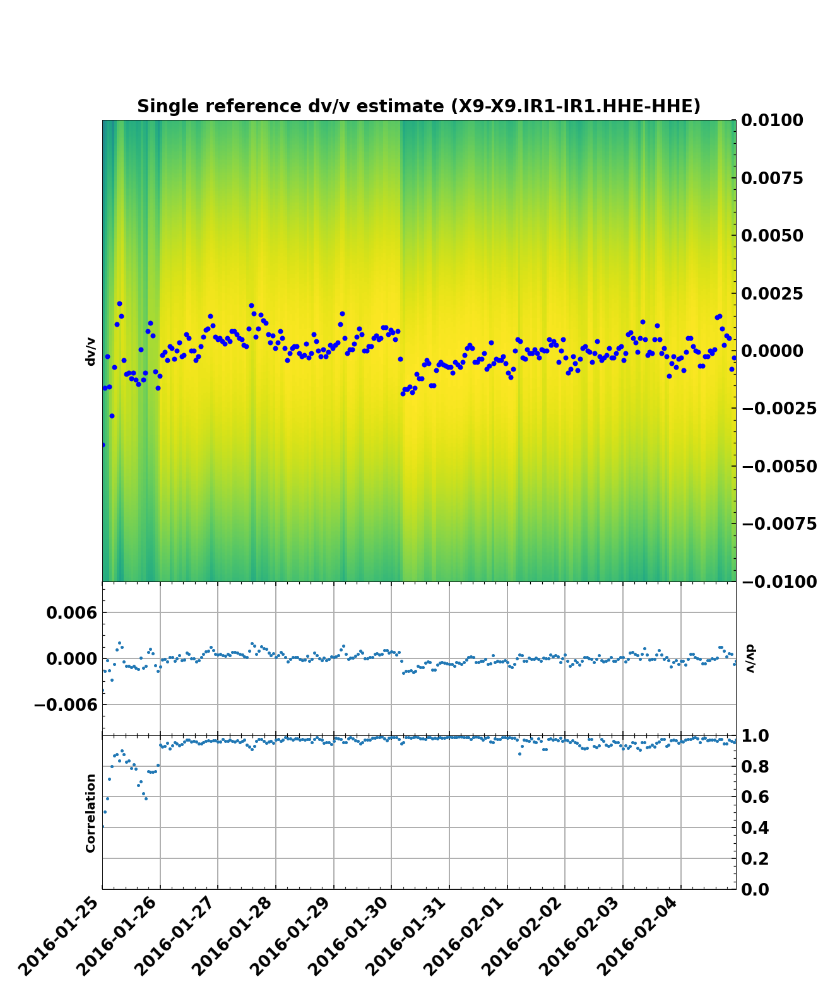

.. mermaid::

    %%{init: { 'logLevel': 'debug', 'theme': 'base' } }%%
    graph LR
        waveform[Get Data] --> correlate(Correlation)
        correlate -->|save| corrdb[(CorrDB/hdf5)]
        corrdb --> monitor
        monitor[Measure dv] -->|save| dv{{DV}}:::active
        click waveform "../trace_data.html" "trace_data"
        click correlate "../correlate.html" "correlate"
        click monitor "../monitor.html" "monitor"
        click corrdb "../corrdb.html" "CorrDB"
        click dv "../monitor/dv.html" "DV"
        classDef active fill:#f666, stroke-width:4px, stroke:#f06;

Reading and Handling of DV objects
----------------------------------

**SeisMIC** uses :py:class:`~seismic.monitor.dv.DV` objects to handle velocity changes. Those can for example saved, loaded, and plotted.
There are also a number of processing functions and methods that use :py:class:`~seismic.monitor.dv.DV` objects.

Read a DV Object from Disk
++++++++++++++++++++++++++

Most likely, you will want to read the velocity changes that were computed in the previous step. **SeisMIC** uses binary ``npz`` format to
store those. You will find the files in the folder that you have defined earlier (i.e., in the yaml file).
Load the object with :py:func:`seismic.monitor.dv.read_dv`. It only takes one argument: the path to the dv object.

.. code-block:: python

    from seismic.monitor.dv import read_dv

    dv = read_dv('/path/to/my/dv/DV-net0-net1.stat0-stat1.ch0-ch1.npz')

    # We can also print some information about them
    print(dv)

single_ref stretch velocity change estimate of X9-X9.IR1-IR1.HHE-HHE.
starttdate: Mon Jan 25 00:00:00 2016
enddate: Fri Feb  5 00:00:00 2016

processed with the following parameters: {'freq_min': 2.0, 'freq_max': 4.0, 'tw_start': 3.5, 'tw_len': 8.5}

Plotting
++++++++

You can create a plot of the dv object with :py:meth:`seismic.monitor.dv.DV.plot`. The result will look like this:

Stacking/Averaging Results from several stretching estimations
++++++++++++++++++++++++++++++++++++++++++++++++++++++++++++++

As shown by `Illien et al. (2023) <https://doi.org/10.1093/gji/ggad038>`_
and `Makus et al. (2023) <https://doi.org/10.1029/2022JB025738>`_,
the similarity matrix (i.e., the result of the stretching grid search) from several
component combinations or stations can be averaged to create more robust velocity change estimates.
This is implemented in the function :py:func:`seismic.monitor.monitor.average_components`.

Inverting Velocity Changes onto a spatial grid
++++++++++++++++++++++++++++++++++++++++++++++

The module `seismic.monitor.spatial` implements the surface wave spatial inversion as proposed by
`Obermann et al. (2013) <https://agupubs.onlinelibrary.wiley.com/doi/full/10.1002/2013JB010399>`_.

In pratice, you will create one :py:class:`~seismic.monitor.spatial.DVGrid` object for each time t that the map should be shown at. 
The inverse solution can be computed as follows:

.. code-block:: python

    from obspy import UTCDateTime

    from seismic.monitor.spatial import DVGrid
    from seismic.monitor.dv import read_dv

    # define map dimensions
    # New, slightly larger coverage
    lat = 10.5
    lon = -110

    # Y-extent in km
    y = 75

    # X-Extent in km
    x = 55

    # Resolution
    res = 1  # km

    # time to check dv/v at
    time = UTCDateTime('2016-01-25T00:00:00')

    # inversion parameters
    # geo-parameters
    vel = 1  # km/s
    # mean free path in kilometres
    mf_path = 80
    # precision of the numerical integration
    dt = .05 # s

    # Damping parameters for Least-Squares Inversion
    # needs to be thoroughly tested, e.g., L-curve criterion
    corr_len = 1  # km
    std_model = .15

    dvs_all = read_dv('/path/to/my/dv/DV-*.npz')

    # create empty grid
    dvgo = DVGrid(lat, lon, res, x, y)

    dvg.compute_dv_grid(dvs_all, time, dt, vel, mf_path, res, corr_len, std_model)

If you want to commit an inverse crime, the forward solution is also implemented in
:py:meth:`~seismic.monitor.spatial.DVGrid.forward_model`. Equally, you can compute the
model resolution using :py:meth:`~seismic.monitor.spatial.DVGrid.compute_resolution`.

.. note::

    :py:class:`~seismic.monitor.spatial.DVGrid` can access many of the required arguments from the :py:class:`~seismic.monitor.dv.DV` object.
    such as the used frequency band or the coda lapse times. In some cases, you might want to overwrite those values though.