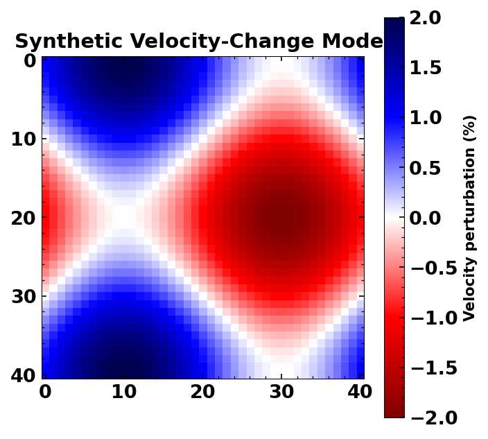
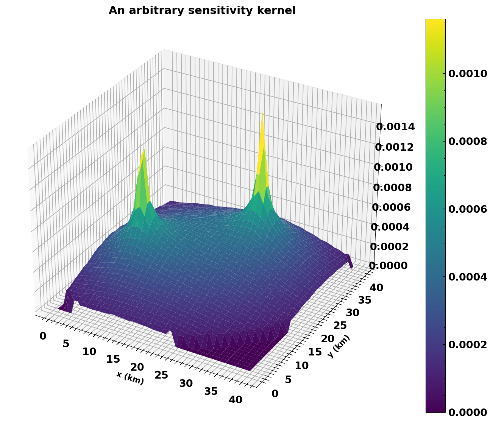
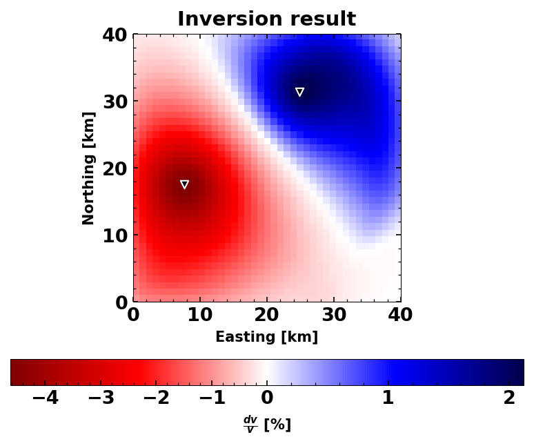
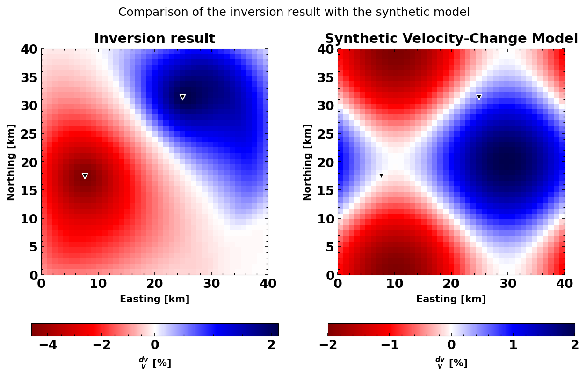

Spatial Inversion of dv/v
=========================

This is the second notebook in the SeisMIC tutorial series. if you have
not looked at the first notebook yet, we strongly comment starting
`there <./tutorial.ipynb>`__.

SeisMIC can invert dv/v time series from several station combination
onto a spatial grid using the method proposed by `Obermann, et
al. (2013) <https://doi.org/10.1002/2013JB010399>`__. This method is
based on 2D sensitivity kernels that arise from the time-dependent
solution of the Boltzmann equation for a homogeneous medium (see
`Paasschens, 1997 <https://doi.org/10.1103/PhysRevE.56.1135>`__). A
demonstration with real data would require a bit too much download and a
very dense network.

So for this demonstration we commit a little “inversion crime” and try
to re-obtain a velocity change model that is already known to us.

Define the parameters
---------------------

We use the class ``seismic.monitor.spatial.DVGrid`` to initialise an
empty grid, for which we compute the sensitivity kernels, the forward
model, and the inverse model.

.. code:: ipython3

    from seismic.monitor.spatial import DVGrid
    
    # For convenience, we define the map at the equator
    lat0 = lon0 = 0  # lower left corner
    
    # Y- and X-extent in km
    y = x = 40
    res = 1  # resolution in km
    vel = 3  # wave velocity km/s
    mf_path = 30  # mean free path in km, dependent on the geology
    dt = 0.05  # Sampling interval to compute the sensitivity kernels
    # dt should be larger than res/vel. If not, the kernels will be aliased.
    # Small dt makes a smoother kernel, but the computation takes longer.
    
    # Initialise the grid
    dvg = DVGrid(lat0, lon0, res, x, y, dt, vel, mf_path)

Create a synthetic velocity grid
--------------------------------

.. code:: ipython3

    import numpy as np
    from matplotlib import pyplot as plt
    from obspy import UTCDateTime
    
    from seismic.plot.plot_utils import set_mpl_params
    
    chkb = np.zeros_like(dvg.xgrid)
    for ii, yy in enumerate(np.arange(y/res+1)):
        chkb[ii, :] = np.sin(
            2*np.pi*np.arange(x/res+1)/(x/res)) + np.cos(2*np.pi*yy/(y/res))
    chkb /= 100
    
    # Plot the synthetic checkerboard
    set_mpl_params()
    plt.figure(figsize=(5, 5))
    plt.imshow(chkb*100, cmap='seismic_r')
    plt.colorbar(label='Velocity perturbation (%)')
    plt.title('Synthetic Velocity-Change Model')

.. parsed-literal::

    Text(0.5, 1.0, 'Synthetic Velocity-Change Model')

Define station locations and compute dv/v values for each combination
---------------------------------------------------------------------

Now we will place stations randomly onto our grid and use a forward
modelling approach to compute the velocity change that would be sensed
between each station pair (i.e., now we will look at
“cross-correlations”).

Feel free to change the number of stations ``nsta`` to see by how much
we can increase the accuracy of our inversion result.

.. code:: ipython3

    
    from seismic.monitor.dv import DV
    from seismic.correlate.stats import CorrStats
    
    ### parameters ###
    #  #### You can play with these parameters to see how it affects the result
    nsta = 2  # number of stations, increases computation time
    
    # lapse time parameters in s
    # don't set these to small (have to contain the ballistic wave arriving
    # with the velocity of the medium)
    tw_start = 10
    tw_len = 17
    
    # frequency band
    freq_min = .5
    freq_max = 1.5
    
    # Should the lapse time window be split up into several subwindows
    # Note that this could increase the spatial sensitivity. But obviously
    # also increases the computation time
    n_split = 1  # if n_split > 1, tw_len has to be divided by n_split
    
    use_auto_correlations = True  # use auto correlations
    use_cross_correlations = True  # use cross correlations
    
    #  #### end of parameters ####
    
    
    # #### actual code ####
    # distribute stations randomly
    np.random.seed(1234)
    sta_x = np.random.random(nsta)*x
    sta_y = np.random.random(nsta)*y
    
    # convert into lat/lon not 100% but good enough as close to equator
    sta_lon = sta_x/111.19492664455873
    sta_lat = sta_y/111.19492664455873
    
    dvs = []
    tw_len = tw_len//n_split
    for slat0, slon0 in zip(sta_lat, sta_lon):
        for slat1, slon1 in zip(sta_lat, sta_lon):
            if slat0 == slat1 and slon0 == slon1 and not use_auto_correlations:
                # we don't want auto correlations
                continue
            if any(
                [slat0 != slat1, slon0 != slon1])\
                    and not use_cross_correlations:
                # we don't want cross correlations
                continue
    
            # create dv.stats
            cst = CorrStats(
                {
                    'stla': slat0, 'stlo': slon0, 'evla': slat1, 'evlo': slon1,
                    'corr_start': np.array(
                        [UTCDateTime(ii*3600) for ii in np.arange(35)]),
                    'corr_end': np.array(
                        [UTCDateTime((ii+1)*3600) for ii in np.arange(35)])})
            for ii in range(n_split):
                dv = DV(
                    .9*np.ones((35, )), np.ones((35, )), 'stretch', None,
                    None, 'modelled', cst,
                    dv_processing={
                        'tw_start': tw_start + ii*tw_len, 'tw_len': tw_len,
                        'freq_min': freq_min, 'freq_max': freq_max})
                dvs.append(dv)

Forward modelling
~~~~~~~~~~~~~~~~~

Depending on your choice of parameters, this could take a little while.
This will compute and cache the sensitivity kernels, so if you add more
stations to the list afterwards, only new sensitivity kernels will be
computed. All the parameters will be extracted from the ``DV`` objects.

.. code:: ipython3

    fwd_model = dvg.forward_model(
        chkb, dvs=dvs, utc=dvs[0].stats.corr_start[5])

add random noise
~~~~~~~~~~~~~~~~

add random noise to the forward model. You can play with the amplitude
here

.. code:: ipython3

    # set standard deviation of the noise from zero
    noise_amp = 1e-3
    
    # add random noise
    # assign values. Technicall we should only set the value at index 5
    # but it doesn't really matter so much
    gen = np.random.Generator(np.random.PCG64(1234))
    for dv, fwd_val in zip(dvs, fwd_model):
        dv.value[:] = fwd_val
        dv.value += gen.normal(size=len(dv.value), scale=noise_amp)

plot a sensitivity kernel
~~~~~~~~~~~~~~~~~~~~~~~~~

Let’s have a look at one of the kernels

.. code:: ipython3

    fig, ax = plt.subplots(subplot_kw={"projection": "3d"}, figsize=(12, 9))
    surf = ax.plot_surface(dvg.xgrid, dvg.ygrid, np.reshape(list(dvg.skernels.values())[-2], dvg.xgrid.shape), linewidth=0, antialiased=True, cmap='viridis')
    plt.colorbar(surf);
    plt.xlabel('x (km)')
    plt.ylabel('y (km)')
    plt.title('An arbitrary sensitivity kernel')

.. parsed-literal::

    Text(0.5, 0.92, 'An arbitrary sensitivity kernel')

Compute inverse model
---------------------

For the inverse model, we will have to set damping parameters. These
parameters are the ``corr_len`` that basically smoothes the final grid
output to avoid sparsities. And ``std_model``, which sets the allowed
standard deviation of the output model (i.e., limits the search radius
around a starting model=0). See Obermann et a., 2013 for details.

.. code:: ipython3

    # smoothing parameters
    corr_len = 3  # correlation length in km
    std_model = 0.05  # standard deviation of the model
    
    inverse_model = dvg.compute_dv_grid(
        dvs, dvs[0].stats.corr_start[5], scaling_factor=res, corr_len=corr_len,
        std_model=std_model)
    
    # Let's have a first look at the result
    dvg.plot()
    plt.title('Inversion result');

Plot a comparison between synthetic and inverse
~~~~~~~~~~~~~~~~~~~~~~~~~~~~~~~~~~~~~~~~~~~~~~~

You will see that increasing the number of stations, will make the
biggest difference to the accuracy of your inversion results. However,
also using several time windows and both auto and cross-correlations
will make an impact. However, it is important to choose the correct
damping parameters. usually, these are determined via an L-curve
criterion.

.. code:: ipython3

    set_mpl_params()
    
    plt.figure(figsize=(10, 6))
    ax1 = plt.subplot(1, 2, 1)
    
    dvg.plot(ax=ax1)
    ax2 = plt.subplot(1, 2, 2, sharey=ax1)
    
    # norm = mpl.colors.TwoSlopeNorm(vcenter=0)
    map2 = ax2.imshow(
        -np.flipud(chkb)*100, cmap='seismic_r',
        extent=[dvg.xaxis.min(), dvg.xaxis.max(), dvg.yaxis.min(), dvg.yaxis.max()]);
    plt.scatter(dvg.statx, dvg.staty, s=30, c='k', edgecolors='white', marker='v')
    plt.xlabel('Easting [km]')
    plt.ylabel('Northing [km]')
    plt.colorbar(map2, orientation='horizontal', label=r'$\frac{dv}{v}$ [%]')
    
    ax1.set_title('Inversion result');
    ax2.set_title('Synthetic Velocity-Change Model');
    
    plt.suptitle('Comparison of the inversion result with the synthetic model');

References
==========

`Obermann, A., Planès, T., Larose, E., and Campillo, M. (2013), Imaging
preeruptive and coeruptive structural and mechanical changes of a
volcano with ambient seismic noise, J. Geophys. Res. Solid Earth, 118,
6285– 6294. <https://doi.org/10.1002/2013JB010399>`__

`Paasschens, J. C. J. “Solution of the time-dependent Boltzmann
equation.” Physical Review E 56.1 (1997):
1135. <https://doi.org/10.1103/PhysRevE.56.1135>`__

Download this notebook
----------------------

You can download this notebook on our `GitHub
page <https://github.com/PeterMakus/SeisMIC/blob/main/examples/>`__
