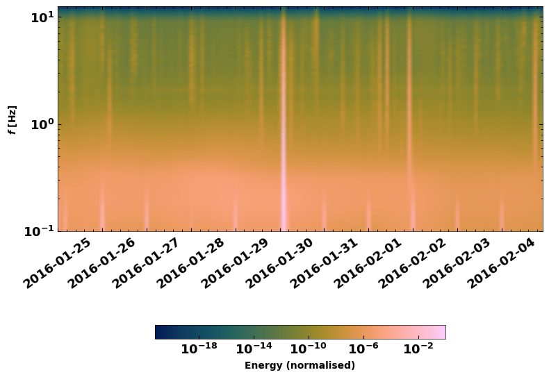

**SeisMIC** Tutorial
====================

.. image:: ./seismic_logo.png

In the following, we will go through a simple example to compute a
ambient noise correlations and monitor velocity changes using
**SeisMIC**.

The source code is hosted here:
`SeisMIC <https://github.com/PeterMakus/SeisMIC>`__.

The documentation, which this notebook is based upon is located here:
`SeisMIC Documentation <https://petermakus.github.io/SeisMIC/>`__.

As an exercise, we will download data from one channel of the station
``X9.IR1`` to investigate the coseismic velocity change caused by the
M7.2 2016 Zhupanov earthquake (see `Makus et. al.,
2023 <https://doi.org/10.1029/2022JB025738>`__). Without further ado,
we’ll dive right into it starting with data download.

1. Download the raw data
------------------------

**SeisMIC** uses `obspy <https://docs.obspy.org/>`__ to download data
from FDSN servers.

To download the data, we will use the
```seismic.trace_data.waveform.Store_Client`` <https://petermakus.github.io/SeisMIC/modules/API.html#seismic.trace_data.waveform.Store_Client>`__
class and its method ``download_waveforms_mdl()``.

.. code:: ipython3

    import os
    
    from obspy.clients.fdsn import Client
    from obspy import UTCDateTime
    
    from seismic.trace_data.waveform import Store_Client
    
    # Get notebook path for future reference of the database:
    try: ipynb_path
    except NameError: ipynb_path = os.getcwd()
    
    os.chdir(ipynb_path)
    
    root = os.path.join(ipynb_path, 'data')
    os.makedirs(root, exist_ok=True)
    
    starttime = UTCDateTime(2016, 1, 25)
    endtime = UTCDateTime(2016, 2, 5)
    network = 'X9'
    station = 'IR1'
    
    
    c = Client('GEOFON')
    sc = Store_Client(c, root, read_only=False)
    sc.download_waveforms_mdl(
        starttime, endtime, clients=[c], network=network,
        station=station, location='*', channel='HHE')


.. parsed-literal::

    [2023-08-24 10:50:29,755] - obspy.clients.fdsn.mass_downloader - INFO: Initializing FDSN client(s) for http://geofon.gfz-potsdam.de.
    [2023-08-24 10:50:29,755] - obspy.clients.fdsn.mass_downloader - INFO: Initializing FDSN client(s) for http://geofon.gfz-potsdam.de.
    [2023-08-24 10:50:29,757] - obspy.clients.fdsn.mass_downloader - INFO: Successfully initialized 1 client(s): http://geofon.gfz-potsdam.de.
    [2023-08-24 10:50:29,757] - obspy.clients.fdsn.mass_downloader - INFO: Successfully initialized 1 client(s): http://geofon.gfz-potsdam.de.
    [2023-08-24 10:50:29,758] - obspy.clients.fdsn.mass_downloader - INFO: Total acquired or preexisting stations: 0
    [2023-08-24 10:50:29,758] - obspy.clients.fdsn.mass_downloader - INFO: Total acquired or preexisting stations: 0
    [2023-08-24 10:50:29,759] - obspy.clients.fdsn.mass_downloader - INFO: Client 'http://geofon.gfz-potsdam.de' - Requesting unreliable availability.
    [2023-08-24 10:50:29,759] - obspy.clients.fdsn.mass_downloader - INFO: Client 'http://geofon.gfz-potsdam.de' - Requesting unreliable availability.
    [2023-08-24 10:50:29,906] - obspy.clients.fdsn.mass_downloader - INFO: Client 'http://geofon.gfz-potsdam.de' - Successfully requested availability (0.15 seconds)
    [2023-08-24 10:50:29,906] - obspy.clients.fdsn.mass_downloader - INFO: Client 'http://geofon.gfz-potsdam.de' - Successfully requested availability (0.15 seconds)
    [2023-08-24 10:50:29,909] - obspy.clients.fdsn.mass_downloader - INFO: Client 'http://geofon.gfz-potsdam.de' - Found 1 stations (1 channels).
    [2023-08-24 10:50:29,909] - obspy.clients.fdsn.mass_downloader - INFO: Client 'http://geofon.gfz-potsdam.de' - Found 1 stations (1 channels).
    [2023-08-24 10:50:29,911] - obspy.clients.fdsn.mass_downloader - INFO: Client 'http://geofon.gfz-potsdam.de' - Will attempt to download data from 1 stations.
    [2023-08-24 10:50:29,911] - obspy.clients.fdsn.mass_downloader - INFO: Client 'http://geofon.gfz-potsdam.de' - Will attempt to download data from 1 stations.
    [2023-08-24 10:50:29,913] - obspy.clients.fdsn.mass_downloader - INFO: Client 'http://geofon.gfz-potsdam.de' - Status for 11 time intervals/channels before downloading: IGNORE
    [2023-08-24 10:50:29,913] - obspy.clients.fdsn.mass_downloader - INFO: Client 'http://geofon.gfz-potsdam.de' - Status for 11 time intervals/channels before downloading: IGNORE
    [2023-08-24 10:50:29,915] - obspy.clients.fdsn.mass_downloader - INFO: Client 'http://geofon.gfz-potsdam.de' - No station information to download.
    [2023-08-24 10:50:29,915] - obspy.clients.fdsn.mass_downloader - INFO: Client 'http://geofon.gfz-potsdam.de' - No station information to download.
    [2023-08-24 10:50:29,916] - obspy.clients.fdsn.mass_downloader - INFO: ============================== Final report
    [2023-08-24 10:50:29,916] - obspy.clients.fdsn.mass_downloader - INFO: ============================== Final report
    [2023-08-24 10:50:29,917] - obspy.clients.fdsn.mass_downloader - INFO: 0 MiniSEED files [0.0 MB] already existed.
    [2023-08-24 10:50:29,917] - obspy.clients.fdsn.mass_downloader - INFO: 0 MiniSEED files [0.0 MB] already existed.
    [2023-08-24 10:50:29,918] - obspy.clients.fdsn.mass_downloader - INFO: 0 StationXML files [0.0 MB] already existed.
    [2023-08-24 10:50:29,918] - obspy.clients.fdsn.mass_downloader - INFO: 0 StationXML files [0.0 MB] already existed.
    [2023-08-24 10:50:29,919] - obspy.clients.fdsn.mass_downloader - INFO: Client 'http://geofon.gfz-potsdam.de' - Acquired 0 MiniSEED files [0.0 MB].
    [2023-08-24 10:50:29,919] - obspy.clients.fdsn.mass_downloader - INFO: Client 'http://geofon.gfz-potsdam.de' - Acquired 0 MiniSEED files [0.0 MB].
    [2023-08-24 10:50:29,920] - obspy.clients.fdsn.mass_downloader - INFO: Client 'http://geofon.gfz-potsdam.de' - Acquired 0 StationXML files [0.0 MB].
    [2023-08-24 10:50:29,920] - obspy.clients.fdsn.mass_downloader - INFO: Client 'http://geofon.gfz-potsdam.de' - Acquired 0 StationXML files [0.0 MB].
    [2023-08-24 10:50:29,920] - obspy.clients.fdsn.mass_downloader - INFO: Downloaded 0.0 MB in total.
    [2023-08-24 10:50:29,920] - obspy.clients.fdsn.mass_downloader - INFO: Downloaded 0.0 MB in total.


Some notes about this: 1. The method ``download_waveforms_mdl()``
expects a list of clients as input. 2. All arguments accept wildcards

If everything worked fine. This should have created a folder called
``data/mseed`` and ``data/inventory``. Let’s check

.. code:: ipython3

    os.listdir('./data/')


.. parsed-literal::

    ['inventory', 'mseed']


1.1 Plot a time-dependent spectrogram
~~~~~~~~~~~~~~~~~~~~~~~~~~~~~~~~~~~~~

A good first step to evaluate how the noise looks in the different
frequency bands is by plotting a spectral series. SeisMIC possesses an
efficient implentation using Welch windows.

.. code:: ipython3

    from seismic.plot.plot_spectrum import plot_spct_series
    from matplotlib import pyplot as plt
    
    f, t, S = sc.compute_spectrogram('X9', 'IR1', 'HHE', starttime, endtime, 7200, freq_max=12.5)
    fig = plt.figure(figsize=(9, 7))
    plot_spct_series(S, f, t, log_scale=True)


.. parsed-literal::

    <Axes: ylabel='$f$ [Hz]'>





2. Compute Correlations
-----------------------

That seems to have worked, so we are ready to use this raw data to
compute ambient noise correlations.

2.1 Parameters
~~~~~~~~~~~~~~

Parameters are provided as a ``yaml`` file or a ``dict`` object. This
tutorial comes with an yaml file to process the data. Let’s have a short
look at it using bash.

.. code:: ipython3

    !cat params.yaml


.. parsed-literal::

    #### Project wide parameters
    # lowest level project directory
    proj_dir : 'data'
    # Save the component combinations in separate hdf5 files
    # This is faster for multi-core if True
    # Set to False for compatibility with SeisMIC version < 0.4.6
    save_comps_separately: True
    # directory for logging information
    log_subdir : 'log'
    # levels:
    # 'DEBUG', 'INFO', 'WARNING', 'ERROR', or 'CRITICAL'
    log_level: 'WARNING'
    # folder for figures
    fig_subdir : 'figures'
    
    
    #### parameters that are network specific
    net:
        # list of stations used in the project
        # type: list of strings or string, wildcards allowed
        network : 'X9'
        station : 'IR1'
    
    #### parameters for correlation (emperical Green's function creation)
    co:
        # subdirectory of 'proj_dir' to store correlation
        # type: string
        subdir : 'corr'
        # times sequences to read for cliping or muting on stream basis
        # These should be long enough for the reference (e.g. the standard
        # deviation) to be rather independent of the parts to remove
        # type: string
        read_start : '2016-01-25 00:00:01.0'
        read_end : '2016-02-05 00:00:00.0'
        # type: float [seconds]
        # The longer the faster, but higher RAM usage.
        # Note that this is also the length of the correlation batches
        # that will be written (i.e., length that will be 
        # kept in memory before writing to disk)
        read_len : 86398
        read_inc : 86400
    
        # New sampling rate in Hz. Note that it will try to decimate
        # if possible (i.e., there is an integer factor from the
        # native sampling_rate)
        sampling_rate : 25
        # Remove the instrument response, will take substantially more time
        remove_response : False
    
        # Method to combine different traces
        combination_method : 'autoComponents'
      
        # If you want only specific combinations to be computed enter them here
        # In the form [Net0-Net0.Stat0-Stat1]
        # This option will only be consider if combination_method == 'betweenStations'
        # Comment or set == None if not in use
        xcombinations : None
    
        # preprocessing of the original length time series
        # these function work on an obspy.Stream object given as first argument
        # and return an obspy.Stream object.
        preProcessing : [
                        {'function':'seismic.correlate.preprocessing_stream.detrend_st',
                        'args':{'type':'linear'}},
                        {'function':'seismic.correlate.preprocessing_stream.cos_taper_st',
                          'args':{'taper_len': 100, # seconds
                                  'lossless': True}}, # lossless tapering stitches additional data to trace, tapers, and removes the tapered ends after preprocessing
                        {'function':'seismic.correlate.preprocessing_stream.stream_filter',
                          'args':{'ftype':'bandpass',
                                  'filter_option':{'freqmin':0.01, #0.01
                                                   'freqmax':12.49}}}
                         #{'function':'seismic.correlate.preprocessing_stream.stream_mute',
                         # 'args':{'taper_len':100,
                         #         'mute_method':'std_factor',
                         #         'mute_value':3}}
                        ]
        # subdivision of the read sequences for correlation
        # if this is set the stream processing will happen on the hourly subdivision. This has the
        # advantage that data that already exists will not need to be preprocessed again
        # On the other hand, computing a whole new database might be slower
        # Recommended to be set to True if:
        # a) You update your database and a lot of the data is already available (up to a magnitude faster)
        # b) corr_len is close to read_len
        # Is automatically set to False if you are computing a completely new db
        preprocess_subdiv: True
        # type: presence of this key
        subdivision:
            # type: float [seconds]
            corr_inc : 3600
            corr_len : 3600
            # recombine these subdivisions
            # unused at the time
            # type: boolean
            recombine_subdivision : True
            # delete
            # type: booblean
            delete_subdivision : False
    
        # parameters for correlation preprocessing
        # Standard functions reside in seismic.correlate.preprocessing_td and preprocessing_fd, respectively
        corr_args : {'TDpreProcessing':[
                                        {'function':'seismic.correlate.preprocessing_td.detrend',
                                        'args':{'type':'linear'}},
                                       {'function':'seismic.correlate.preprocessing_td.TDfilter',
                                       'args':{'type':'bandpass','freqmin':2,'freqmax':4}},
                                        #{'function':'seismic.correlate.preprocessing_td.mute',
                                        # 'args':{'taper_len':100.,
                                               # 'threshold':1000, absolute threshold
                                        #         'std_factor':3,
                                        #         'filter':{'type':'bandpass','freqmin':2,'freqmax':4},
                                        #         'extend_gaps':True}},
                                      #  {'function':'seismic.correlate.preprocessing_td.clip',
                                      #   'args':{'std_factor':2.5}},
                                       {'function':'seismic.correlate.preprocessing_td.signBitNormalization',
                                        'args': {}}
                                       ],
                      # Standard functions reside in seismic.correlate.preprocessing_fd
                     'FDpreProcessing':[
                                        # {'function':'seismic.correlate.preprocessing_fd.spectralWhitening',
                                        #  'args':{'joint_norm':False}},
                                        {'function':'seismic.correlate.preprocessing_fd.FDfilter',
                                         'args':{'flimit':[1.33, 2, 4, 6]}}
                                        #  {'function':seismic.correlate.preprocessing_fd.FDsignBitNormalization,
                                        # 'args':{}}
                                        ],
                     'lengthToSave':25,
                     'center_correlation':True,      # make sure zero correlation time is in the center
                     'normalize_correlation':True,
                     'combinations':[]
                    }
    
    
    #### parameters for the estimation of time differences
    dv:
        # subfolder for storage of time difference results
        subdir : 'vel_change'
    
        # Plotting
        plot_vel_change : True
    
        ### Definition of calender time windows for the time difference measurements
        start_date : '2016-01-25 00:00:00.0'   # %Y-%m-%dT%H:%M:%S.%fZ'
        end_date : '2016-02-05 00:00:00.0'
        win_len : 3600                         # length of window in which EGFs are stacked
        date_inc : 3600                        # increment of measurements
    
        ### Frequencies
        freq_min : 2
        freq_max : 4
    
        ### Definition of lapse time window
        tw_start : 3.5     # lapse time of first sample [s]
        tw_len : 8.5       # length of window [s] Can be None if the whole (rest) of the coda should be used
        sides : 'both'   # options are left (for acausal), right (causal), both, or single (for active source experiments where the first sample is the trigger time)
        compute_tt : False  # Computes the travel time and adds it to tw_start (tt is 0 if not xstations). If true a rayleigh wave velocity has to be provided
        rayleigh_wave_velocity : 1  # rayleigh wave velocity in km/s, will be ignored if compute_tt=False
        
    
        ### Range to try stretching
        stretch_range : 0.03
        stretch_steps : 1001
      
        #### Reference trace extraction
        #  win_inc : Length in days of each reference time window to be used for trace extraction
        # If == 0, only one trace will be extracted
        # If > 0, mutliple reference traces will be used for the dv calculation
        # Can also be a list if the length of the windows should vary
        # See seismic.correlate.stream.CorrBulk.extract_multi_trace for details on arguments
        dt_ref : {'win_inc' : 0, 'method': 'mean', 'percentile': 50}
    
        # preprocessing on the correlation bulk or corr_stream before stretch estimation
        preprocessing: [
                        #{'function': 'pop_at_utcs', 'args': {'utcs': np.array([UTCDateTime()])},
                        {'function': 'smooth', 'args': {'wsize': 4, 'wtype': 'hanning', 'axis': 1}}
        ]
    
        # postprocessing of dv objects before saving and plotting
        postprocessing: [
                          # {'function': 'smooth_sim_mat', 'args': {'win_len': 7, exclude_corr_below: 0}}
        ]
    
    #### parameters to compute the waveform coherence
    wfc:
      # subfolder for storage of time difference results
        subdir : 'wfc'
    
        ### Definition of calender time windows for the time difference measurements
        start_date : '2016-01-25 00:00:00.0'   # %Y-%m-%dT%H:%M:%S.%fZ'
        end_date : '2016-02-05 00:00:00.0'
        win_len : 3600                         # length of window in which EGFs are stacked
        date_inc : 3600                        # increment of measurements
    
        ### Frequencies
        # can be lists of same length
        freq_min : [0.0625, 0.09, 0.125, 0.1875, 0.25, 0.375, 0.5, 0.75, 1, 1.5, 2, 3, 4, 5, 6, 8]
        freq_max : [0.125, 0.18, 0.25, 0.375, 0.5, 0.75, 1, 1.5, 2, 3, 4, 6, 8, 10, 12, 12.49]
    
        ### Definition of lapse time window
        # can be lists of same length or tw_start: List and tw_len: single value (will be applied to all)
        tw_start : [0, 1.25, 2.5, 3.75, 5, 6.25, 7.5, 8.75, 10, 11.25, 12.5, 13.75, 15, 16.25, 17.5, 17.75, 20]     # lapse time of first sample [s]
        tw_len : 5       # length of window [s]
      
        #### Reference trace extraction
        #  win_inc : Length in days of each reference time window to be used for trace extraction
        # If == 0, only one trace will be extracted
        # If > 0, mutliple reference traces will be used for the dv calculation
        # Can also be a list if the length of the windows should vary
        # See seismic.correlate.stream.CorrBulk.extract_multi_trace for details on arguments
        dt_ref : {'win_inc' : 0, 'method': 'mean', 'percentile': 50}
    
        # preprocessing on the correlation bulk before stretch estimation
        preprocessing: [
                        {'function': 'smooth', 'args': {'wsize': 4, 'wtype': 'hanning', 'axis': 1}}
        ]
    
        ### SAVING
        # save components separately or only their average?
        save_comps: False
    


Each of the parameters is described in the
`Documentation <https://petermakus.github.io/SeisMIC/modules/correlate/get_started.html>`__.

To start the computation of the correlation we will use
```MPI`` <https://mpi4py.readthedocs.io/>`__ and a simple python script,
which could look like this:

.. code:: ipython3

    !cat correlate.py


.. parsed-literal::

    import os
    # This tells numpy to only use one thread
    # As we use MPI this is necessary to avoid overascribing threads
    os.environ['OPENBLAS_NUM_THREADS'] = '1'
    
    from time import time
    
    from obspy.clients.fdsn import Client
    
    from seismic.correlate.correlate import Correlator
    from seismic.trace_data.waveform import Store_Client
    
    # Path to the paramter file we created in the step before
    params = 'params.yaml'
    # You don't have to set this (could be None)
    client = Client('GEOFON')
    # root is the same as proj_dir in params.yaml
    root = 'data'
    sc = Store_Client(client, root)
    
    c = Correlator(sc, options=params)
    print('Correlator initiated')
    x = time()
    st = c.pxcorr()
    print('Correlation finished after', time()-x, 'seconds')


2.2 Start correlation
---------------------

To start the correlation, we will use the ``mpirun`` command in bash:

Jupyter notebook limits the output, so if you wish to see the complete
output, you might prefer actually executing these commands in a
terminal.

.. code:: ipython3

    import os
    # This gives number of threads, usually twice as many as physical cores
    ncpus = os.cpu_count()//2
    !mpirun -n $ncpus python correlate.py


.. parsed-literal::

    Correlator initiated
    Correlator initiated
    2023-08-24 10:52:59,811 - WARNING - No existing data found.
    Automatically setting preprocess_subdiv to False to optimise performance.
      0%|          | 0/11 [00:00<?, ?it/s]Correlator initiated
    Correlator initiated
      0%|          | 0/11 [00:00<?, ?it/s]Correlator initiated
      0%|          | 0/11 [00:00<?, ?it/s]Correlator initiated
    100%|██████████| 11/11 [00:16<00:00,  1.51s/it]
    100%|██████████| 11/11 [00:20<00:00,  1.82s/it]
    100%|██████████| 11/11 [00:20<00:00,  1.82s/it]
    100%|██████████| 11/11 [00:19<00:00,  1.78s/it]
    100%|██████████| 11/11 [00:20<00:00,  1.82s/it]
    100%|██████████| 11/11 [00:20<00:00,  1.82s/it]
    Correlation finished after 16.573271989822388 seconds
    Correlation finished after 19.590983629226685 seconds
    Correlation finished after 20.04919147491455 secondsCorrelation finished after 20.06204128265381 seconds
    
    Correlation finished after 20.04917287826538 seconds
    Correlation finished after 20.276748657226562 seconds


Now let’s have a look at those correlations. To do so, we use the
```CorrelationDataBase`` <https://petermakus.github.io/SeisMIC/modules/API.html#seismic.db.corr_hdf5.CorrelationDataBase>`__
object. All correlations are saved in the folder ``data/corr`` as
defined in our params.yaml file.

.. code:: ipython3

    from seismic.db.corr_hdf5 import CorrelationDataBase
    
    with CorrelationDataBase(f'data/corr/{network}-{network}.{station}-{station}.HHE-HHE.h5', mode='r') as cdb:
        # find the available labels
        print(list(cdb.keys()))


.. parsed-literal::

    ['co', 'stack_86398', 'subdivision']


**SeisMIC’s** standard labels are ``'subdivision`` for the correlations
of corr_len and ``stack_*stacklen*`` for the stack (with *stacklen*
being the length of the stack in seconds).

**SeisMIC** uses some sort of “combined seed codes” structured as above.

.. code:: ipython3

    with CorrelationDataBase(f'data/corr/{network}-{network}.{station}-{station}.HHE-HHE.h5', mode='r') as cdb:
        # find the available labels
        print(cdb.get_available_channels(
            tag='stack_86398', network=f'{network}-{network}', station=f'{station}-{station}'))
        print(cdb.get_available_starttimes(
            tag='subdivision', network=f'{network}-{network}', station=f'{station}-{station}', channel='*'))
        cst = cdb.get_data(f'{network}-{network}', f'{station}-{station}', 'HHE-HHE', 'subdivision')
    print(type(cst))
    
    # filter frequencies, so we can see something
    cst = cst.filter('bandpass', freqmin=2, freqmax=4)


.. parsed-literal::

    ['HHE-HHE']
    {'HHE-HHE': ['2016025T000001.0000Z', '2016025T010001.0000Z', '2016025T020001.0000Z', '2016025T030001.0000Z', '2016025T040001.0000Z', '2016025T050001.0000Z', '2016025T060001.0000Z', '2016025T070001.0000Z', '2016025T080001.0000Z', '2016025T090001.0000Z', '2016025T100001.0000Z', '2016025T110001.0000Z', '2016025T120001.0000Z', '2016025T130001.0000Z', '2016025T140001.0000Z', '2016025T150001.0000Z', '2016025T160001.0000Z', '2016025T170001.0000Z', '2016025T180001.0000Z', '2016025T190001.0000Z', '2016025T200001.0000Z', '2016025T210001.0000Z', '2016025T220001.0000Z', '2016025T230001.0000Z', '2016026T000001.0000Z', '2016026T010001.0000Z', '2016026T020001.0000Z', '2016026T030001.0000Z', '2016026T040001.0000Z', '2016026T050001.0000Z', '2016026T060001.0000Z', '2016026T070001.0000Z', '2016026T080001.0000Z', '2016026T090001.0000Z', '2016026T100001.0000Z', '2016026T110001.0000Z', '2016026T120001.0000Z', '2016026T130001.0000Z', '2016026T140001.0000Z', '2016026T150001.0000Z', '2016026T160001.0000Z', '2016026T170001.0000Z', '2016026T180001.0000Z', '2016026T190001.0000Z', '2016026T200001.0000Z', '2016026T210001.0000Z', '2016026T220001.0000Z', '2016026T230001.0000Z', '2016027T000001.0000Z', '2016027T010001.0000Z', '2016027T020001.0000Z', '2016027T030001.0000Z', '2016027T040001.0000Z', '2016027T050001.0000Z', '2016027T060001.0000Z', '2016027T070001.0000Z', '2016027T080001.0000Z', '2016027T090001.0000Z', '2016027T100001.0000Z', '2016027T110001.0000Z', '2016027T120001.0000Z', '2016027T130001.0000Z', '2016027T140001.0000Z', '2016027T150001.0000Z', '2016027T160001.0000Z', '2016027T170001.0000Z', '2016027T180001.0000Z', '2016027T190001.0000Z', '2016027T200001.0000Z', '2016027T210001.0000Z', '2016027T220001.0000Z', '2016027T230001.0000Z', '2016028T000001.0000Z', '2016028T010001.0000Z', '2016028T020001.0000Z', '2016028T030001.0000Z', '2016028T040001.0000Z', '2016028T050001.0000Z', '2016028T060001.0000Z', '2016028T070001.0000Z', '2016028T080001.0000Z', '2016028T090001.0000Z', '2016028T100001.0000Z', '2016028T110001.0000Z', '2016028T120001.0000Z', '2016028T130001.0000Z', '2016028T140001.0000Z', '2016028T150001.0000Z', '2016028T160001.0000Z', '2016028T170001.0000Z', '2016028T180001.0000Z', '2016028T190001.0000Z', '2016028T200001.0000Z', '2016028T210001.0000Z', '2016028T220001.0000Z', '2016028T230001.0000Z', '2016029T000001.0000Z', '2016029T010001.0000Z', '2016029T020001.0000Z', '2016029T030001.0000Z', '2016029T040001.0000Z', '2016029T050001.0000Z', '2016029T060001.0000Z', '2016029T070001.0000Z', '2016029T080001.0000Z', '2016029T090001.0000Z', '2016029T100001.0000Z', '2016029T110001.0000Z', '2016029T120001.0000Z', '2016029T130001.0000Z', '2016029T140001.0000Z', '2016029T150001.0000Z', '2016029T160001.0000Z', '2016029T170001.0000Z', '2016029T180001.0000Z', '2016029T190001.0000Z', '2016029T200001.0000Z', '2016029T210001.0000Z', '2016029T220001.0000Z', '2016029T230001.0000Z', '2016030T000001.0000Z', '2016030T010001.0000Z', '2016030T020001.0000Z', '2016030T030001.0000Z', '2016030T040001.0000Z', '2016030T050001.0000Z', '2016030T060001.0000Z', '2016030T070001.0000Z', '2016030T080001.0000Z', '2016030T090001.0000Z', '2016030T100001.0000Z', '2016030T110001.0000Z', '2016030T120001.0000Z', '2016030T130001.0000Z', '2016030T140001.0000Z', '2016030T150001.0000Z', '2016030T160001.0000Z', '2016030T170001.0000Z', '2016030T180001.0000Z', '2016030T190001.0000Z', '2016030T200001.0000Z', '2016030T210001.0000Z', '2016030T220001.0000Z', '2016030T230001.0000Z', '2016031T000001.0000Z', '2016031T010001.0000Z', '2016031T020001.0000Z', '2016031T030001.0000Z', '2016031T040001.0000Z', '2016031T050001.0000Z', '2016031T060001.0000Z', '2016031T070001.0000Z', '2016031T080001.0000Z', '2016031T090001.0000Z', '2016031T100001.0000Z', '2016031T110001.0000Z', '2016031T120001.0000Z', '2016031T130001.0000Z', '2016031T140001.0000Z', '2016031T150001.0000Z', '2016031T160001.0000Z', '2016031T170001.0000Z', '2016031T180001.0000Z', '2016031T190001.0000Z', '2016031T200001.0000Z', '2016031T210001.0000Z', '2016031T220001.0000Z', '2016031T230001.0000Z', '2016032T000001.0000Z', '2016032T010001.0000Z', '2016032T020001.0000Z', '2016032T030001.0000Z', '2016032T040001.0000Z', '2016032T050001.0000Z', '2016032T060001.0000Z', '2016032T070001.0000Z', '2016032T080001.0000Z', '2016032T090001.0000Z', '2016032T100001.0000Z', '2016032T110001.0000Z', '2016032T120001.0000Z', '2016032T130001.0000Z', '2016032T140001.0000Z', '2016032T150001.0000Z', '2016032T160001.0000Z', '2016032T170001.0000Z', '2016032T180001.0000Z', '2016032T190001.0000Z', '2016032T200001.0000Z', '2016032T210001.0000Z', '2016032T220001.0000Z', '2016032T230001.0000Z', '2016033T000001.0000Z', '2016033T010001.0000Z', '2016033T020001.0000Z', '2016033T030001.0000Z', '2016033T040001.0000Z', '2016033T050001.0000Z', '2016033T060001.0000Z', '2016033T070001.0000Z', '2016033T080001.0000Z', '2016033T090001.0000Z', '2016033T100001.0000Z', '2016033T110001.0000Z', '2016033T120001.0000Z', '2016033T130001.0000Z', '2016033T140001.0000Z', '2016033T150001.0000Z', '2016033T160001.0000Z', '2016033T170001.0000Z', '2016033T180001.0000Z', '2016033T190001.0000Z', '2016033T200001.0000Z', '2016033T210001.0000Z', '2016033T220001.0000Z', '2016033T230001.0000Z', '2016034T000001.0000Z', '2016034T010001.0000Z', '2016034T020001.0000Z', '2016034T030001.0000Z', '2016034T040001.0000Z', '2016034T050001.0000Z', '2016034T060001.0000Z', '2016034T070001.0000Z', '2016034T080001.0000Z', '2016034T090001.0000Z', '2016034T100001.0000Z', '2016034T110001.0000Z', '2016034T120001.0000Z', '2016034T130001.0000Z', '2016034T140001.0000Z', '2016034T150001.0000Z', '2016034T160001.0000Z', '2016034T170001.0000Z', '2016034T180001.0000Z', '2016034T190001.0000Z', '2016034T200001.0000Z', '2016034T210001.0000Z', '2016034T220001.0000Z', '2016034T230001.0000Z', '2016035T000001.0000Z', '2016035T010001.0000Z', '2016035T020001.0000Z', '2016035T030001.0000Z', '2016035T040001.0000Z', '2016035T050001.0000Z', '2016035T060001.0000Z', '2016035T070001.0000Z', '2016035T080001.0000Z', '2016035T090001.0000Z', '2016035T100001.0000Z', '2016035T110001.0000Z', '2016035T120001.0000Z', '2016035T130001.0000Z', '2016035T140001.0000Z', '2016035T150001.0000Z', '2016035T160001.0000Z', '2016035T170001.0000Z', '2016035T180001.0000Z', '2016035T190001.0000Z', '2016035T200001.0000Z', '2016035T210001.0000Z', '2016035T220001.0000Z', '2016035T230001.0000Z']}
    <class 'seismic.correlate.stream.CorrStream'>


``cst`` is now a
```CorrStream`` <https://petermakus.github.io/SeisMIC/modules/API.html#seismic.correlate.stream.CorrStream>`__
- an obspy based object to handle correlations. We can plot those in a
section plot for example by time:

.. code:: ipython3

    from matplotlib import pyplot as plt
    
    plt.figure(figsize=(8, 10))
    ax0 = plt.subplot(2, 1, 1)
    
    cst.plot(timelimits=[-20, 20], cmap='seismic', vmin=-0.5, vmax=0.5, ax=ax0)
    ax0.set_title(f'Autocorrelation {network}.{station}.HHE')
    ax1 = plt.subplot(2, 1, 2)
    cst.plot(scalingfactor=3, timelimits=[0, 20], type='section', ax=ax1)


.. parsed-literal::

    <Axes: xlabel='$\\tau$ [s]'>


.. image:: tutorial_files/tutorial_18_1.png


If you look very very closely, you can see a slight time shift in the
late coda on January 30th. This time shift is associated to the Zhupanov
earthquake. We will try to quantify the velocity change in the
following.

We can also look at a single correlations or at a stack of correlations.
SeisMIC can stack correlation with ``CorrStream.stack``:

.. code:: ipython3

    corrstack = cst.stack()[0]
    corrstack.plot(tlim=[-20,20])


.. parsed-literal::

    <Axes: xlabel='Lag Time [s]', ylabel='Correlation'>


.. image:: tutorial_files/tutorial_20_1.png


Let’s try and combine the two last plots
~~~~~~~~~~~~~~~~~~~~~~~~~~~~~~~~~~~~~~~~

.. code:: ipython3

    plt.figure(figsize=(8, 10))
    ax0 = plt.subplot(2, 1, 1)
    
    cst.plot(timelimits=[-20, 20], cmap='seismic', vmin=-0.5, vmax=0.5, ax=ax0)
    ax0.set_title(f'(a)')
    ax0.plot(
        corrstack.times(),
        [UTCDateTime(i).datetime for i in corrstack.data*3e5 +  UTCDateTime(2016, 1, 31).timestamp],
        color='k', zorder=100, linewidth=1.1)
    
    ax1 = plt.subplot(2, 1, 2)
    cst.plot(scalingfactor=3, timelimits=[0, 20], type='section', ax=ax1)
    ax1.set_title(f'(b)')


.. parsed-literal::

    Text(0.5, 1.0, '(b)')


3. Waveform Coherence
---------------------

We can assess the average stability of the wavefield in different
frequency bands and along the lapse time axis using a measure called the
waveform coherence (see ,e.g., Steinmann, et al., 2021). The waveform
coherence is the zero lag correlation of two noise correlations. Here we
average them for one station and given frequency and lapse time bands.

For this step, we will have to compute a few more noise correlations
over various frequency bands. That’s why the next cell will take a
while.

.. code:: ipython3

    !python wfc.py


.. parsed-literal::

    2023-08-24 10:54:53,301 - WARNING - No existing data found.
    Automatically setting preprocess_subdiv to False to optimise performance.
    100%|███████████████████████████████████████████| 11/11 [00:05<00:00,  1.92it/s]
    2023-08-24 10:54:59,090 - WARNING - No existing data found.
    Automatically setting preprocess_subdiv to False to optimise performance.
    2023-08-24 10:54:59,090 - WARNING - No existing data found.
    Automatically setting preprocess_subdiv to False to optimise performance.
    100%|███████████████████████████████████████████| 11/11 [00:05<00:00,  2.02it/s]
    2023-08-24 10:55:04,616 - WARNING - No existing data found.
    Automatically setting preprocess_subdiv to False to optimise performance.
    2023-08-24 10:55:04,616 - WARNING - No existing data found.
    Automatically setting preprocess_subdiv to False to optimise performance.
    2023-08-24 10:55:04,616 - WARNING - No existing data found.
    Automatically setting preprocess_subdiv to False to optimise performance.
    100%|███████████████████████████████████████████| 11/11 [00:05<00:00,  2.04it/s]
    2023-08-24 10:55:10,090 - WARNING - No existing data found.
    Automatically setting preprocess_subdiv to False to optimise performance.
    2023-08-24 10:55:10,090 - WARNING - No existing data found.
    Automatically setting preprocess_subdiv to False to optimise performance.
    2023-08-24 10:55:10,090 - WARNING - No existing data found.
    Automatically setting preprocess_subdiv to False to optimise performance.
    2023-08-24 10:55:10,090 - WARNING - No existing data found.
    Automatically setting preprocess_subdiv to False to optimise performance.
    100%|███████████████████████████████████████████| 11/11 [00:05<00:00,  1.96it/s]
    2023-08-24 10:55:15,767 - WARNING - No existing data found.
    Automatically setting preprocess_subdiv to False to optimise performance.
    2023-08-24 10:55:15,767 - WARNING - No existing data found.
    Automatically setting preprocess_subdiv to False to optimise performance.
    2023-08-24 10:55:15,767 - WARNING - No existing data found.
    Automatically setting preprocess_subdiv to False to optimise performance.
    2023-08-24 10:55:15,767 - WARNING - No existing data found.
    Automatically setting preprocess_subdiv to False to optimise performance.
    2023-08-24 10:55:15,767 - WARNING - No existing data found.
    Automatically setting preprocess_subdiv to False to optimise performance.
    100%|███████████████████████████████████████████| 11/11 [00:05<00:00,  1.97it/s]
    2023-08-24 10:55:21,427 - WARNING - No existing data found.
    Automatically setting preprocess_subdiv to False to optimise performance.
    2023-08-24 10:55:21,427 - WARNING - No existing data found.
    Automatically setting preprocess_subdiv to False to optimise performance.
    2023-08-24 10:55:21,427 - WARNING - No existing data found.
    Automatically setting preprocess_subdiv to False to optimise performance.
    2023-08-24 10:55:21,427 - WARNING - No existing data found.
    Automatically setting preprocess_subdiv to False to optimise performance.
    2023-08-24 10:55:21,427 - WARNING - No existing data found.
    Automatically setting preprocess_subdiv to False to optimise performance.
    2023-08-24 10:55:21,427 - WARNING - No existing data found.
    Automatically setting preprocess_subdiv to False to optimise performance.
    100%|███████████████████████████████████████████| 11/11 [00:05<00:00,  1.98it/s]
    2023-08-24 10:55:27,068 - WARNING - No existing data found.
    Automatically setting preprocess_subdiv to False to optimise performance.
    2023-08-24 10:55:27,068 - WARNING - No existing data found.
    Automatically setting preprocess_subdiv to False to optimise performance.
    2023-08-24 10:55:27,068 - WARNING - No existing data found.
    Automatically setting preprocess_subdiv to False to optimise performance.
    2023-08-24 10:55:27,068 - WARNING - No existing data found.
    Automatically setting preprocess_subdiv to False to optimise performance.
    2023-08-24 10:55:27,068 - WARNING - No existing data found.
    Automatically setting preprocess_subdiv to False to optimise performance.
    2023-08-24 10:55:27,068 - WARNING - No existing data found.
    Automatically setting preprocess_subdiv to False to optimise performance.
    2023-08-24 10:55:27,068 - WARNING - No existing data found.
    Automatically setting preprocess_subdiv to False to optimise performance.
    100%|███████████████████████████████████████████| 11/11 [00:05<00:00,  2.00it/s]
    100%|█████████████████████████████████████████████| 1/1 [00:00<00:00,  1.12it/s]
    100%|█████████████████████████████████████████████| 1/1 [00:00<00:00,  1.11it/s]
    100%|█████████████████████████████████████████████| 1/1 [00:00<00:00,  1.07it/s]
    100%|█████████████████████████████████████████████| 1/1 [00:00<00:00,  1.05it/s]
    100%|█████████████████████████████████████████████| 1/1 [00:00<00:00,  1.07it/s]
    100%|█████████████████████████████████████████████| 1/1 [00:00<00:00,  1.06it/s]
    100%|█████████████████████████████████████████████| 1/1 [00:00<00:00,  1.07it/s]


.. code:: ipython3

    from seismic.monitor.wfc import WFCBulk
    from seismic.monitor.wfc import read_wfc
    
    wfcs = read_wfc('data/wfc/WFC-X9-X9.IR1-IR1.av.*.npz')
    WFCBulk(wfcs).plot(log=True, cmap='batlow')


.. parsed-literal::

    <Axes: xlabel='Central Lag Time [s]', ylabel='Centre Frequency [Hz]'>


.. image:: tutorial_files/tutorial_25_0.png


4. Monitoring
-------------

Next, we will compute a velocity change estimate using the stretching
technique (`Sens-Schönfelder & Wegler,
2006 <https://agupubs.onlinelibrary.wiley.com/doi/abs/10.1029/2006gl027797>`__).
You can find the corresponding parameters in the ``dv`` section of the
``params.yaml`` file.

Similarly to the Correlation we can start the monitoring via a simple
script:

.. code:: ipython3

    !cat monitor.py


.. parsed-literal::

    import os
    # This tells numpy to only use one thread
    # As we use MPI this is necessary to avoid overascribing threads
    os.environ['OPENBLAS_NUM_THREADS'] = '1'
    
    from seismic.monitor.monitor import Monitor
    
    yaml_f = 'params.yaml'
    m = Monitor(yaml_f)
    m.compute_velocity_change_bulk()


.. code:: ipython3

    try: ipynb_path
    except NameError: ipynb_path = os.getcwd()
    
    os.chdir(ipynb_path)
    
    # multi-core is not necessarily useful for this example
    # because the jobs are split into N jobs, where N is the number of
    # component combinations (in our case N==1)
    ncpus = os.cpu_count()//2
    !mpirun -n $ncpus python ./monitor.py


.. parsed-literal::

    0it [00:00, ?it/s]
    0it [00:00, ?it/s]/1 [00:00<?, ?it/s]
    0it [00:00, ?it/s]
    0it [00:00, ?it/s]
    0it [00:00, ?it/s]
    saving to X9-X9_IR1-IR1_HHE-HHE
    100%|██████████| 1/1 [00:04<00:00,  4.43s/it]


Make a first plot to get an idea of *dv/v*
~~~~~~~~~~~~~~~~~~~~~~~~~~~~~~~~~~~~~~~~~~

We can use SeisMIC’s inbuilt plotting function for that. The velocity
changes will in general be shown in decimal values.

.. code:: ipython3

    from seismic.monitor.dv import read_dv
    dv = read_dv(f'data/vel_change/DV-{network}-{network}.{station}-{station}.HHE-HHE.npz')
    dv.plot(ylim=(-0.01,0.01))
    
    # We can print some information about the dv object
    print(dv)


.. parsed-literal::

    single_ref stretch velocity change estimate of X9-X9.IR1-IR1.HHE-HHE.
    starttdate: Mon Jan 25 00:00:00 2016
    enddate: Fri Feb  5 00:00:00 2016
    
    processed with the following parameters: {'freq_min': 2.0, 'freq_max': 4.0, 'tw_start': 3.5, 'tw_len': 8.5}


Even with comparably little data, we can see the velocity drop on
January 30th. Note that due to the high energy noise, we are able to
retrieve a very high resolution estimate of *dv/v*.

Make the plot look a little nicer
---------------------------------

The plot above is very good if you just want to understand what is going
on, but maybe it is not necessarily something you would want to put into
a publication. Here is a code that makes the plot look like in the above
mentioned publication

.. code:: ipython3

    from obspy import UTCDateTime
    
    from seismic.plot.plot_utils import set_mpl_params
    
    set_mpl_params()
    
    # Origin Time of the Zhupanov earthquake
    otime = UTCDateTime(2016, 1, 30, 3, 25).datetime
    
    fig, ax = dv.plot(style='publication', return_ax=True, ylim=(-.75,.75),
                      dateformat='%d %b')
    
    plt.axvline(otime, linestyle='dashed', c='r', label='M7.2')
    plt.legend()


.. parsed-literal::

    <matplotlib.legend.Legend at 0x7f6293a57730>


.. image:: tutorial_files/tutorial_33_1.png


What comes next?
================

Increasing the stability
------------------------

In this case, we are fortunate enough to receive a high-resolution
``dv/v`` estimate with the given parameters (not quite by coincidence
;-)).

For many other datasets, you might not be able to achieve satisfactory
stability. Here are some suggestions on how you could tackle that: 1.
Increase the smoothing. This can be done over a number of different
ways, all of them can be configured in ``params.yaml``: - increase
``dv['win_len']`` to stack correlations over the defined amount of time
(in seconds) - in ``dv['preprocessing']`` increase the parameter
``wsize`` of the ``smooth`` function to smoooth the correlation
functions over a larger amount of time (see
`documentation <https://petermakus.github.io/SeisMIC/modules/API.html#seismic.correlate.stream.CorrBulk.smooth>`__)
- In ``dv['postprocessing']`` set a smoothing of the similarity matrix
(see
`documentation <https://petermakus.github.io/SeisMIC/modules/API.html#seismic.monitor.dv.DV.smooth_sim_mat>`__)
2. Try different frequencies, different lag time windows of the coda or
a different preprocessing. 3. Stack the results from several component
combinations as done in `Illien et
al. 2023 <https://academic.oup.com/gji/article-abstract/234/1/124/7008901>`__.
The corresponding function in Seismic is in
`seismic.monitor.monitor.average_component_combinations() <https://petermakus.github.io/SeisMIC/modules/API.html#seismic.monitor.monitor.average_components>`__

Explore other processing possibilities
--------------------------------------

There are a large number of flavours for different processing options
explored. Some of which are natively shipped in SeisMIC. You can
experiment with options to processing your noise correlation functions
differently or compute *dv/v* differently (e.g., thinking about other
algorithms than the stretching technique). By the way: the dictionaries
in the different processing parameters in ``params.yaml`` allow to
import external functions as long as they are scripted in the right way
(see link).

Invert for a velocity change map
--------------------------------

The module ``seismic.monitor.spatial`` implements the surface wave
spatial inversion as proposed by `Obermann et
al. (2013) <https://agupubs.onlinelibrary.wiley.com/doi/full/10.1002/2013JB010399>`__.
Consult the documentation, to learn how to work with spatial inversions.
You can continue with the `spatial Jupyter Notebook <./spatial.ipynb>`__
to learn how to do a spatial inversion with SeisMIC.

References
==========

List of references used in this notebook.

`Illien, Luc, Christoph Sens-Schönfelder, and Kuan-Yu Ke. “Resolving
minute temporal seismic velocity changes induced by earthquake damage:
the more stations, the merrier?.” Geophysical Journal International
234.1 (2023): 124-135. <https://doi.org/10.1093/gji/ggad038>`__

`Makus, P., Sens-Schönfelder, C., Illien, L., Walter, T. R., Yates, A.,
& Tilmann, F. (2023). Deciphering the whisper of volcanoes: Monitoring
velocity changes at Kamchatka’s Klyuchevskoy group with fluctuating
noise fields. Journal of Geophysical Research: Solid Earth, 128,
e2022JB025738. <https://doi.org/10.1029/2022JB025738>`__

`Obermann, A., Planès, T., Larose, E., and Campillo, M. (2013), Imaging
preeruptive and coeruptive structural and mechanical changes of a
volcano with ambient seismic noise, J. Geophys. Res. Solid Earth, 118,
6285– 6294. <https://doi.org/10.1002/2013JB010399>`__

`Steinmann, R., Hadziioannou, C., & Larose, E. (2020). Effect of
centimetric freezing of the near subsurface on Rayleigh and Love wave
velocity in ambient seismic noise correlations. Geophysical Journal
International, 224(1), 626-636. <https://doi.org/10.1093/gji/ggaa406>`__

Download this notebook
----------------------

You can download this notebook on our `GitHub
page <https://github.com/PeterMakus/SeisMIC/blob/main/examples/>`__
